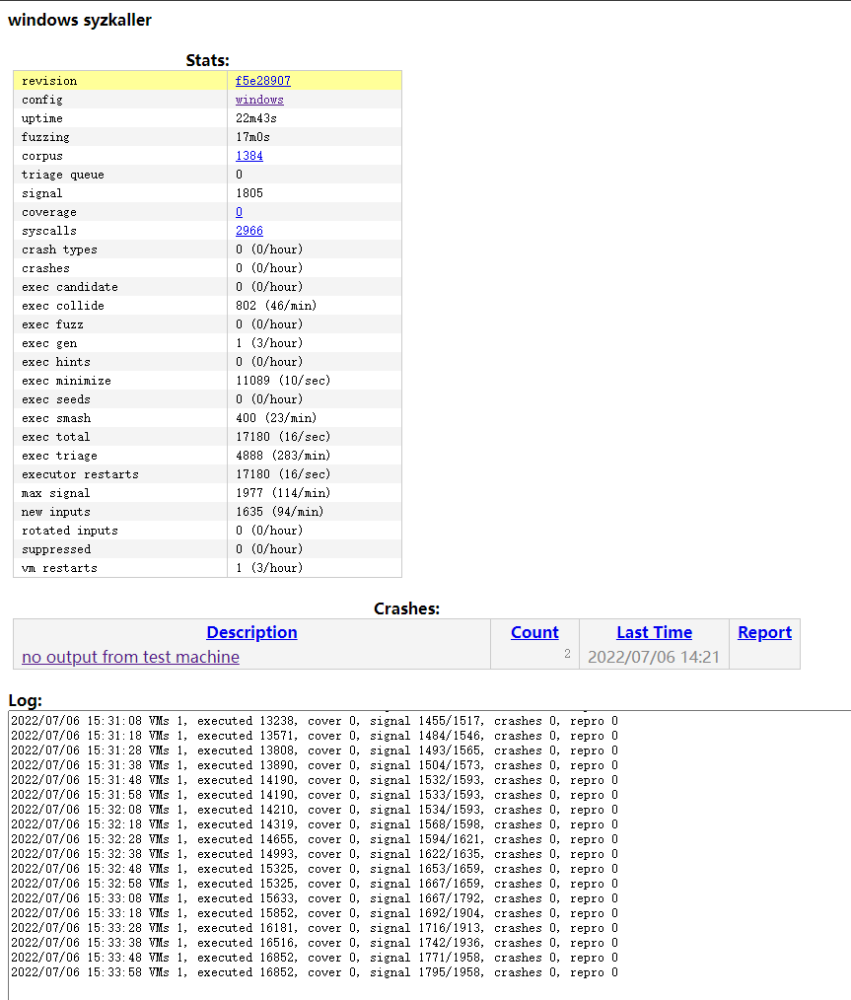
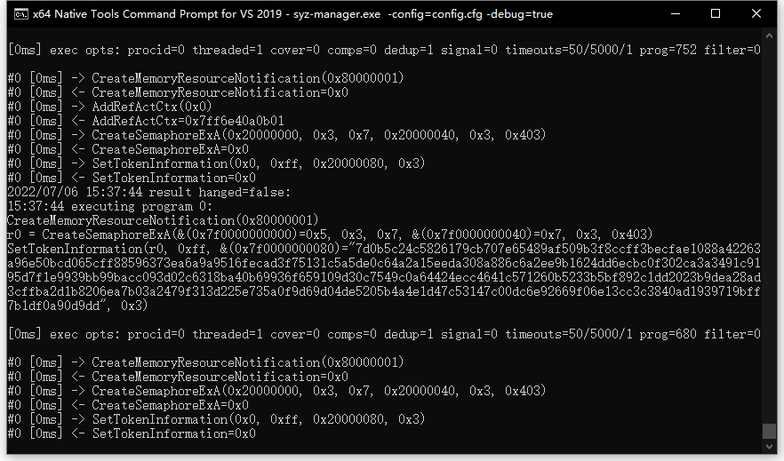
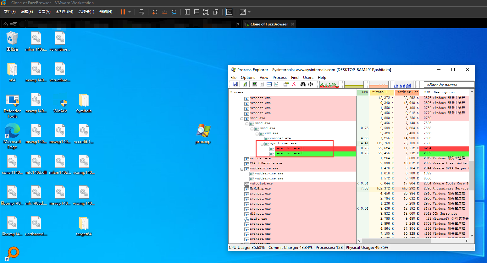

# syzkaller - kernel fuzzer

`syzkaller` (`[siːzˈkɔːlə]`) is an unsupervised coverage-guided kernel fuzzer.\
Only Supported OS: `Windows`.

Mailing list: [syzkaller@googlegroups.com](https://groups.google.com/forum/#!forum/syzkaller) (join on [web](https://groups.google.com/forum/#!forum/syzkaller) or by [email](mailto:syzkaller+subscribe@googlegroups.com)).

Found bugs: [Windows](docs/windows/README.md).

## Documentation

Initially, original syzkaller was developed with Linux kernel fuzzing in mind, but now
it's being extended to support Windows kernels as well.
Most of the documentation at this moment is related to the [Windows](docs/windows/README.md) kernel.

- [How to install syzkaller](docs/setup.md)
- [How to use syzkaller](docs/usage.md)
- [How syzkaller works](docs/internals.md)
- [How to contribute to syzkaller](docs/contributing.md)
- [Tech talks and articles](docs/talks.md)
- [Research work based on syzkaller](docs/research.md)

## Disclaimer

This is not an official Google product.
